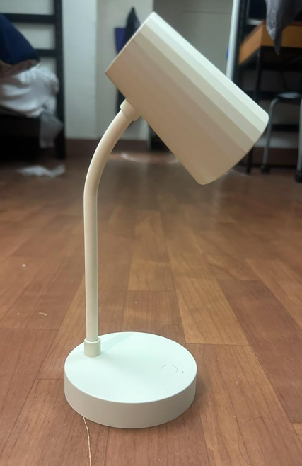
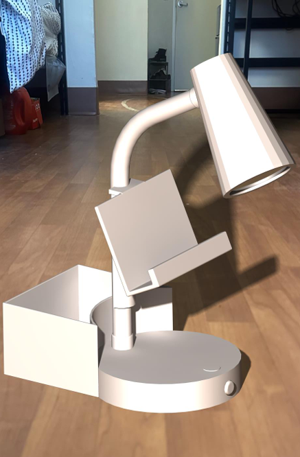

# Multifunctional Desk Lamp

> **Modified a conventional desk lamp into a multifunctional workspace accessory by integrating a pen holder, phone cradle, and storage drawer into the lamp base.**

---

## PROJECT OVERVIEW

This project was completed as part of my **CATIA V5 coursework** at Embry-Riddle Aeronautical University. The assignment challenged me to take a simple desk lamp and modify its design to provide additional functionality while maintaining the overall purpose and usability of the original product.

I redesigned the lamp base to integrate three additional features: a **back pen holder, a phone cradle, and a storage drawer**, creating a more versatile desk accessory without changing the fundamental lighting function.

---

## DESIGN OBJECTIVES

The main objectives of the redesign were:

- **Increase Functionality:** Transform a basic desk lamp into a multifunctional workspace accessory.
- **Maintain the Original Function:** Preserve the lamp's primary lighting purpose.
- **Integrate Storage:** Add dedicated spaces for frequently used desk items.
- **Improve Workspace Organization:** Incorporate a phone cradle, pen holder, and drawer into the existing footprint.
- **Maintain Design Cohesion:** Integrate the new features into the lamp base without making the design appear unnecessarily complex.
- **Develop CAD Skills:** Apply CATIA V5 modeling and assembly techniques to a complete product redesign.

---

## 01/ DESIGN CONCEPT

The project began with a simple desk lamp that provided lighting but offered limited functionality beyond illumination.

*Original desk lamp before modification.*

I approached the redesign by identifying common items that occupy workspace around a desk and determining how they could be incorporated directly into the lamp.

The redesigned base integrates:

- **Pen Holder** — Provides a dedicated location for pens and small writing tools.
- **Phone Cradle** — Creates a convenient location for a smartphone while working.
- **Storage Drawer** — Provides enclosed storage for small desk accessories.

The goal was to add functionality while keeping the additional features integrated into the original lamp rather than creating separate accessories.

---

## 02/ CAD & DESIGN

The redesigned lamp was modeled using **CATIA V5**, with the additional features incorporated into the lamp's base.

The CAD development focused on:

- Designing the modified lamp base.
- Creating the integrated pen holder.
- Modeling the phone cradle.
- Adding a functional storage drawer.
- Maintaining the overall proportions of the original lamp.
- Integrating the new components into a cohesive assembly.
- Checking the relationship between components within the assembly.

*Rendering CATIA V5 model of the redesigned multifunctional desk lamp.*

---

## 03/ ENGINEERING ANALYSIS

The design process required considering how each new feature would interact with the existing lamp structure and how the additional components could be integrated without interfering with the lamp's primary function.

### Functional Integration

The three additional features were positioned around the lamp base to make use of otherwise unused space.

### Phone Cradle

The phone cradle was incorporated into the base to provide a stable location for a smartphone while keeping it easily accessible.

### Pen Holder

A dedicated rear pen holder was added to organize writing tools while minimizing interference with the main workspace.

### Storage Drawer

A drawer was integrated into the lamp base to provide enclosed storage for smaller desk items.

### Assembly Design

CATIA V5 assembly modeling was used to bring the components together and verify their spatial relationships.

---

## 04/ FINAL DESIGN

The final design transforms the original desk lamp into a multifunctional workspace accessory while maintaining its primary lighting purpose.

*Final multifunctional desk lamp design.*

### Key Features

- **Integrated Pen Holder:** Provides accessible storage for writing tools.
- **Phone Cradle:** Creates a dedicated location for a smartphone.
- **Storage Drawer:** Adds enclosed storage for small desk accessories.
- **Modified Lamp Base:** Combines the additional functions into the original lamp footprint.
- **Unified Product Design:** Integrates the new features into a single cohesive assembly.

---

## TOOLS & SKILLS

**CAD:** CATIA V5  
**Engineering:** Mechanical Design • Product Design • Assembly Modeling  
**Design:** Functional Integration • Design Modification • Spatial Layout  
**Other:** CAD Modeling • Design Iteration • Product Development

---

<a href="{{ '/Mandrel' | relative_url }}">← Previous Project</a>

&nbsp;&nbsp;&nbsp;|&nbsp;&nbsp;&nbsp;

<a href="{{ '/' | relative_url }}">Back to Portfolio</a>

&nbsp;&nbsp;&nbsp;|&nbsp;&nbsp;&nbsp;

<a href="{{ '/Halloween' | relative_url }}">Next Project →</a>

