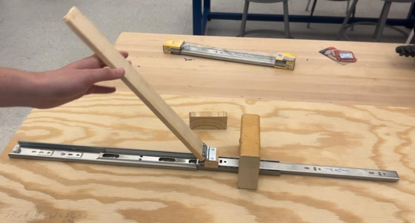
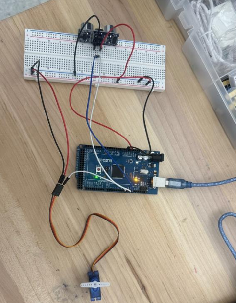

# Halloween Animatronic - The Mummy

> **Designed and built a motion-activated Halloween animatronic that combines a mechanical lifting mechanism, ultrasonic sensing, and servo-controlled head movement to create an automated mummy rising from a coffin.**

---

## PROJECT OVERVIEW

The Halloween Animatronic was a **group engineering project for EGR 101 at Embry-Riddle Aeronautical University**. Our team designed and built an interactive mummy that could detect nearby movement and respond by raising its upper body and rotating its head.

The project combined **mechanical design, embedded programming, sensors, motors, and physical prototyping** to create an automated system. The final design used an HC-SR04 ultrasonic sensor, Arduino UNO, geared DC motor, servo motor, pulley system, and drawer-slide-guided lifting mechanism.

---

## DESIGN OBJECTIVES

The main objectives of the project were:

- **Motion Detection:** Detect a person approaching the animatronic.
- **Automated Movement:** Raise the mummy automatically when motion is detected.
- **Multiple Movements:** Combine body lifting with head rotation.
- **Mechanical Stability:** Develop a guided lifting mechanism for controlled movement.
- **System Integration:** Combine mechanical, electrical, and programming components into one functional system.
- **Interactive Design:** Create an engaging and reliable Halloween display.

---

## 01/ MECHANICAL DESIGN

The lifting mechanism was designed to raise the mummy's upper body while maintaining controlled and guided movement.

The mechanism incorporated:

- **Drawer Slide:** Guided the mummy's linear lifting motion.
- **Pulley System:** Transferred motion from the motor to the lifting mechanism.
- **Geared DC Motor:** Provided the primary lifting force.
- **Hinges and Joints:** Allowed the mummy's upper body to rotate upward.
- **Structural Supports:** Provided stability for the mechanism.
- **3D-Printed Hip Brackets:** Connected the lifting mechanism to the mummy's skeleton.

*Mechanical lifting mechanism developed for the animatronic.*

The combination of the drawer slide and pulley system allowed the mummy to move along a controlled path while the motor provided the required actuation.

---

## 02/ ELECTRONICS & CONTROL SYSTEM

An **Arduino UNO** served as the primary controller for the animatronic.

### Main Components

- **Arduino UNO**
- **HC-SR04 Ultrasonic Sensor**
- **9g Servo Motor**
- **12V Geared DC Motor**
- **L9110S H-Bridge Motor Driver**
- **9V and 12V Battery Packs**
- **Breadboard**
- **Resistors**

The Arduino processed the ultrasonic sensor input and controlled the servo movement. The geared DC motor was powered through the motor driver and used to raise and lower the mummy.

*Electronics system used to control the animatronic.*

---

## 03/ MOTION DETECTION & PROGRAMMING

The animatronic used an **HC-SR04 ultrasonic sensor** to detect movement near the coffin.

Instead of relying only on a fixed distance, the program compared consecutive distance measurements. A significant change in measured distance was interpreted as a person approaching the animatronic.

The Arduino program coordinated the ultrasonic sensor, DC motor, and servo motor into a single automated sequence. Once motion was detected, the system activated the lifting mechanism, rotated the mummy's head, and then returned the system to its starting position.

The control system used a **5 cm change in measured distance as the motion-detection threshold**, with distance measurements taken approximately every **500 ms**. This approach allowed the system to respond to changes in the surrounding environment rather than relying solely on a fixed detection distance.

---

## FINAL DESIGN

The final system integrated the **mechanical lifting mechanism, electronic control system, ultrasonic sensing, and programmed motion** into a single interactive Halloween animatronic.

*Final Halloween Mummy animatronic.*

### Key Features

- **Motion Activated:** Detects nearby movement using an HC-SR04 ultrasonic sensor.
- **Motorized Lift:** Raises the mummy using a geared DC motor and pulley system.
- **Guided Motion:** Uses a drawer slide to maintain a controlled lifting path.
- **Head Rotation:** Uses a servo motor to create a secondary animated movement.
- **Automated Reset:** Reverses the DC motor to return the mummy to its starting position.
- **Integrated Control:** Uses an Arduino UNO to coordinate sensor input and actuator movement.

### System Integration

The final prototype demonstrated how **mechanical, electrical, and software subsystems must work together** to produce a reliable automated system. The ultrasonic sensor provided the input, the Arduino processed the detection, and the motors translated the programmed commands into physical movement.

During testing, the team identified a mismatch between the motor driver's current capability and the geared motor's current requirements. This highlighted the importance of evaluating **electrical component specifications and operating loads** during system integration, rather than selecting components based only on their nominal functionality.

---

## TOOLS & SKILLS

**Programming:** Arduino IDE • Embedded C/C++

**Electronics:** Arduino UNO • HC-SR04 Ultrasonic Sensor • Servo Motor • DC Motor • H-Bridge Motor Driver

**Mechanical:** Mechanism Design • Pulley Systems • Linkages • Motion Control

**Fabrication:** 3D Printing • Woodworking • Mechanical Assembly

**Engineering:** Prototyping • System Integration • Troubleshooting • Design Documentation

**Teamwork:** Collaborative Design • Engineering Communication • Cross-Disciplinary Problem Solving

---

<a href="{{ '/Desklamp' | relative_url }}">← Previous Project</a>

&nbsp;&nbsp;&nbsp;|&nbsp;&nbsp;&nbsp;

<a href="{{ '/' | relative_url }}">Back to Portfolio</a>

