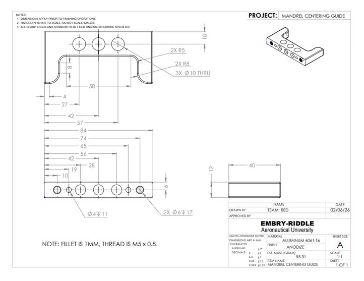
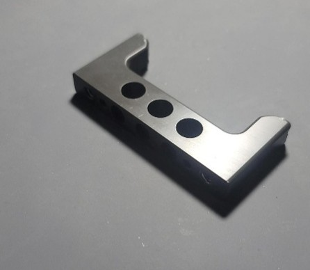

# Mandrel Centering Guide

> **Redesign of a precision mandrel centering guide to improve alignment, reduce stress concentrations and surface wear, and increase component service life in a medical manufacturing environment.**

---

## PROJECT OVERVIEW

The Mandrel Centering Guide is used in the **Form, Fill, and Seal (FFS) production room at B. Braun Medical's Daytona Beach, Florida facility**. The guide centers a mandrel during the welding and sealing process, where accurate positioning is critical to maintaining port alignment, seal integrity, and product quality.

The existing component was identified as a recurring source of concern due to **cyclic fatigue, stress concentration, surface chipping, localized wear, and progressive mandrel misalignment**. The project focused on evaluating the component's material, geometry, loading conditions, and assembly interaction to develop practical design improvements. 

---

## DESIGN OBJECTIVES

The main objectives of the redesign were:

- **Improve Durability:** Reduce stress concentrations and fatigue-related damage.
- **Reduce Wear:** Address chipping and localized material loss at contact surfaces.
- **Improve Alignment:** Reduce off-axis contact between the mandrel and guide.
- **Extend Service Life:** Develop modifications that could reduce maintenance frequency.
- **Maintain Manufacturability:** Improve the existing component without requiring a complete redesign of the surrounding assembly.
- **Maintain Cleanroom Compatibility:** Select an appropriate material and surface treatment for the application.

---

## 01/ MATERIAL ANALYSIS & SELECTION

Material identification was an important part of the redesign because the initial documentation indicated that the component was **316 stainless steel**.

Physical evaluation, hardness testing, mass measurement, visual inspection, SolidWorks mass-property analysis, and consultation with a subject matter expert indicated that the component was more consistent with **anodized aluminum, potentially 6061**. 

The measured specimen mass was approximately **55.6 g**, while the SolidWorks model predicted approximately **57 g**, a difference of approximately **2.5%**.

Based on the material evaluation, **6061-T6 aluminum with an anodized finish** was selected for the redesigned component because it provided a practical balance of strength, machinability, weight, cost, and suitability for the application. 
---

## 02/ CAD & DESIGN

The redesigned component was modeled in **SolidWorks**, incorporating geometric changes intended to address the observed failure mechanisms.

The redesign focused on:

- Increasing critical internal corner radii.
- Adding chamfered transitions.
- Refining the mandrel contact surfaces.
- Maintaining the functional geometry of the existing component.
- Producing a fully dimensioned engineering drawing.

*Fully dimensioned engineering drawing of the redesigned Mandrel Centering Guide.*

---

## 03/ ENGINEERING ANALYSIS

The design modifications were developed around the primary failure mechanisms identified during the investigation.

### Stress Concentration

Increasing the internal fillet radii was proposed to reduce localized stress concentrations and distribute cyclic loading more gradually.

### Contact Loading

The centering surfaces showed evidence of chipping and localized material loss. Chamfered transitions and refined contact surfaces were proposed to create smoother engagement between the mandrel and guide. 
### Alignment

Review of the mandrel's engagement with the guide indicated that off-axis contact could contribute to excessive localized loading. Precision shims were proposed to improve the seating position and distribute contact stresses more uniformly. 
### Surface Treatment

A **Type III hard-coat anodize** was proposed to increase surface hardness and improve resistance to chipping and wear while retaining the lightweight aluminum construction. 

---

## 04/ MANUFACTURING

The redesigned component was manufactured by using CNC machine.
The design changes were intentionally limited to modifications that could improve the component without requiring a complete redesign of the surrounding assembly.

*Manufactured Mandrel Centering Guide.*

---

## FINAL DESIGN

The final design combines **geometric optimization, material selection, surface treatment, and alignment improvements**.

### Key Features

- **Increased Corner Radii:** Reduce localized stress concentrations.
- **Chamfered Edges:** Provide smoother mandrel engagement.
- **Refined Contact Surfaces:** Address areas of observed wear and chipping.
- **6061-T6 Aluminum:** Maintain a lightweight and machinable material.
- **Hard-Coat Anodizing:** Improve surface hardness and wear resistance.
- **Precision Shimming:** Improve mandrel seating and alignment.

The proposed changes are intended to extend component service life, reduce maintenance frequency, and improve mandrel alignment consistency during production.

---

## TOOLS & SKILLS

**CAD:** SolidWorks  
**Engineering:** Mechanical Design • GD&T • Tolerance Analysis • Material Selection  
**Analysis:** Fatigue • Stress Concentration • Contact Loading • Geometric Analysis  
**Manufacturing:** Precision Machining • Anodizing • Engineering Drawings  
**Other:** Material Identification • Design Evaluation • Technical Documentation

---

<a href="{{ '/' | relative_url }}">← Back to Portfolio</a>

&nbsp;&nbsp;&nbsp;|&nbsp;&nbsp;&nbsp;

<a href="{{ '/Desklamp' | relative_url }}">Next Project →</a>

