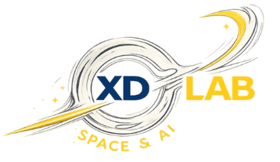

<!--Section 1: Introduce yourself-->

<strong style="font-size:1.5em;">ABOUT ME</strong>

Hello! I'm <strong>Le Na Hoang</strong>, a junior Mechanical Engineering student at Embry-Riddle Aeronautical University with a <em>4.0 GPA</em>, specializing in robotics, autonomous systems, and mechanical design. I enjoy solving multidisciplinary engineering problems through CAD design, programming, prototyping, and analytical modeling.

My interest in engineering began in Vietnam, where I attended a gifted high school specializing in Physics. There, I built a strong theoretical and analytical foundation, but much of what I learned remained on paper through equations and theoretical problem-solving. Moving to the United States for college transformed how I viewed engineering. The hands-on learning environment encouraged me to build, prototype, and test ideas, sparking a curiosity about how the world around me actually works. Since then, I've found the greatest excitement in turning concepts into tangible solutions through research and engineering projects.

Outside of engineering, one of my favorite places to be is the kitchen. I love cooking and experimenting with new recipes, especially Asian cuisine that reminds me of home while introducing me to flavors from different cultures. I find the process surprisingly similar to engineering: every recipe is an opportunity to test ideas, refine techniques, and learn through iteration until everything comes together. It's a creative outlet that reminds me to stay curious, embrace experimentation, and enjoy the process as much as the final result.

As I continue my career, I hope to contribute to innovative teams developing technologies in robotics, aerospace, or advanced mechanical systems that solve meaningful real-world problems.

<!--Mention your top/relevant skills here - core and soft skills-->

<strong style="font-size: 1.5em;">WHAT I DO / MY SPECIALTIES</strong>

<em>As a Mechanical Engineering student at Embry-Riddle Aeronautical University, I focus on design, analysis, manufacturing, and hands-on problem solving across mechanical, robotic, and aerospace systems.</em>

<strong>Mechanical Design &amp; CAD:</strong> 
Design mechanical components, fixtures, and assemblies in SolidWorks and CATIA while producing industry-standard engineering drawings and applying GD&amp;T principles for manufacturability.

<strong>Robotics &amp; Automation:</strong> 
Develop embedded control systems, including sensor integration, actuation, and motion sequencing, for autonomous and sensor-driven mechanisms.

<strong>Advanced Manufacturing:</strong> 
Bring designs to life through CNC machining, welding, and precision assembly, taking projects from CAD models to fabricated and tested prototypes.

<strong>Building Systems &amp; BIM:</strong> 
Develop and coordinate HVAC system designs using Revit while gaining experience with Building Information Modeling (BIM) and multidisciplinary engineering workflows.

<!--Section 3: Professional experience — keep this strong and specific-->
## PROFESSIONAL EXPERIENCE

**HDR Architecture & Engineering Inc. / Mechanical Engineering Intern** *(05/2026 - 08/2026)*

<a href="HDR.md" target="_blank"> View More </a>

---

** XDLab / Undergraduate Researcher ** *(09/2025 - 05/2026)*

---

**ERAU Hunt Library / Library Technician** *(03/2025 - Present)*

<!--Section 2: List 3-4 key projects-->
## MY COURSEWORK EXPERIENCES

*A glimpse of some of the engineering projects I've been working on.*

**Mandrel Centering Guide — Medical Manufacturing Fixture**

*Problem Statement:* Designed and fabricated a precision fixture to improve mandrel alignment accuracy during medical device production, applying GD&T and tolerance stack-up analysis to meet tight positional requirements.

[View Documentation](projects/mandrel-centering-guide/README.md) &nbsp;|&nbsp; [Download Report (PDF)](projects/mandrel-centering-guide/report.pdf)

---

**Multifunctional Desk Lamp — CATIA Final Project**

*Problem Statement:* Designed a manufacturable desk lamp assembly integrating a phone holder, storage drawer, and lighting into one product, using constraint-based assembly modeling in CATIA V5 to verify stability and motion clearance.

[View Documentation](projects/desk-lamp-catia/README.md) &nbsp;|&nbsp; [Download Report (PDF)](projects/desk-lamp-catia/report.pdf)

---

**Halloween Animatronic — Embedded Systems Project**

*Problem Statement:* Designed and programmed an autonomous animatronic capable of detecting nearby users via ultrasonic sensing and performing synchronized, servo-driven movement sequences.

[View Documentation](projects/halloween-animatronic/README.md) &nbsp;|&nbsp; [Download Report (PDF)](projects/halloween-animatronic/report.pdf)

---

<!--Section 4: Honors & Awards — list each award with a link to its certificate/verification-->
## HONORS & AWARDS

*A few of the academic honors and scholarships I've received along the way.*

<table>
  <tbody>
    <tr>
      <td>⭐</td>
      <td>4.0 / 4.0 GPA and Dean's List </td>
      <td><a href="LNH_transcript_2026.pdf">View transcript</a></td>
    </tr>
     <tr>
      <td>🎓</td>
      <td>National STEM Excellence Scholarship</td>
      <td><a href="National STEM Excellence Scholarship.png">View Certificate</a></td>
    </tr>
     <tr>
      <td>🎓</td>
      <td>ASME IGTI Foundation Scholarship</td>
      <td><a href="ASME_Award_26.pdf">View Certificate</a></td>
    </tr>
     <tr>
      <td>🎓</td>
      <td>AFCEA STEM Major Scholarship </td>
      <td><a href="AFCEA Scholarship Announcement.png">View Certificate</a></td>
    </tr>
    <tr>
      <td>🎓</td>
      <td>ASME Hanley Foundation Scholarship</td>
      <td><a href="ASME_HanleyFoundation_25.pdf">View Certificate</a></td>
    </tr>
   
    <!--Add additional rows here as you receive more awards, following the same format-->
  </tbody>
</table>

## CONTACT DETAILS

*Let's connect — I'm always excited to discuss opportunities in mechanical engineering, robotics, aerospace systems, and research!*
<table>
  <tbody>
    <tr>
      <td>📧</td>
      <td><a href="mailto: lenaforwork33@gmail.com ">lenaforwork33@gmail.com</a></td>
    </tr>
    <tr>
      <td>📍</td>
      <td>Daytona Beach, FL</td>
    </tr>
    <tr>
      <td>⬇️</td>
      <td><a href="docs/resume.pdf">Download my Resume (PDF)</a></td>
    </tr>
    <tr>
      <td>🌐</td>
      <td><a href="https://www.linkedin.com/in/le-na-hoang/">Connect with me on LinkedIn</a></td>
    </tr>
  </tbody>
</table>
