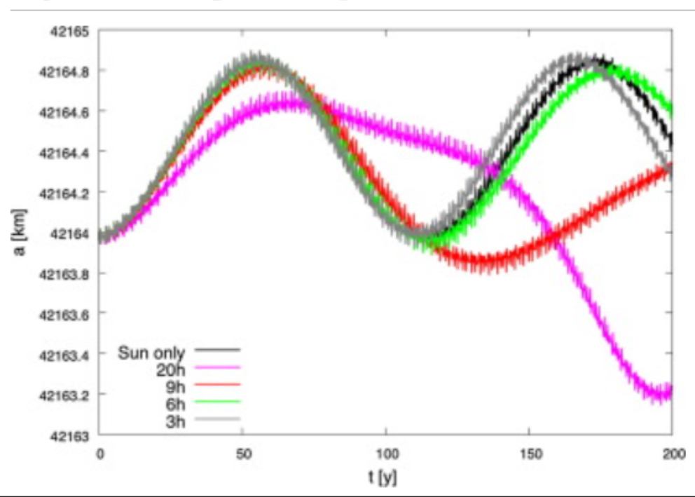
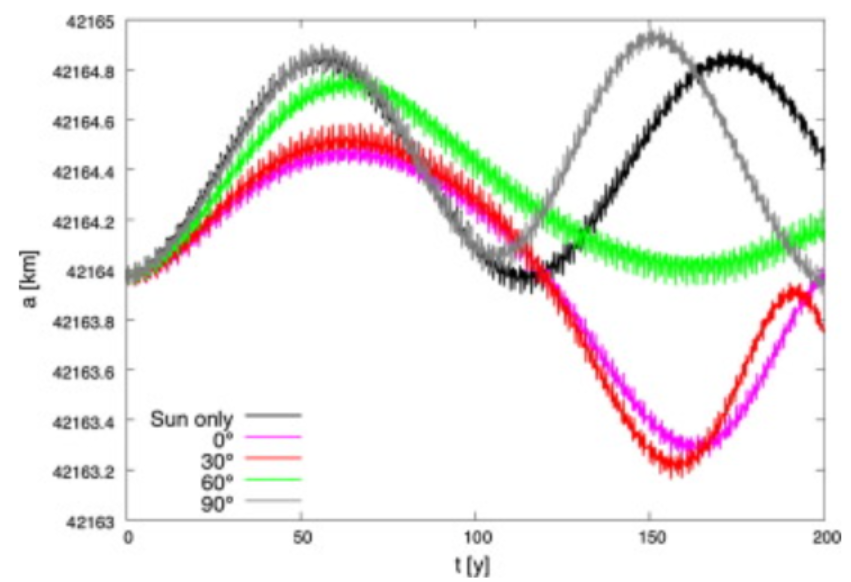
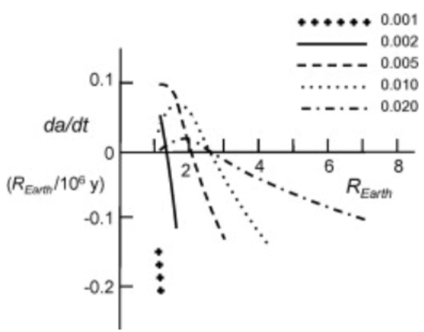
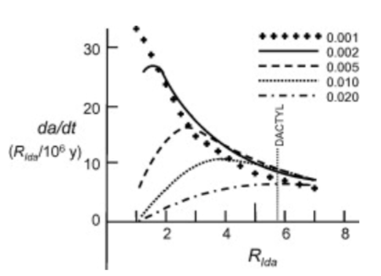

# XDLab #
## Undergraduate Researcher
*September 2025 – May 2026*

## ABOUT THE LAB

XDLab is an undergraduate research environment focused on developing practical solutions to advanced aerospace and applied AI engineering problems through research, modeling, simulation, and hands-on development. 

---

## FEATURED RESEARCH

### Yarkovsky Effect for Particles in Circumlunar Space

**Research Focus:** Yarkovsky Effect, Small-Body Dynamics, Circumlunar Environments, Computational Modeling

### National Conference on Undergraduate Research (NCUR) 2026

*Embry-Riddle Team at NCUR 2026*

### THE PROBLEM

The long-term accumulation of orbital debris is commonly discussed in the context of Earth, where atmospheric drag can gradually remove smaller objects from orbit. However, future lunar and asteroid missions will operate in environments where atmospheric drag is extremely weak or effectively absent.

This raises a different question:

> **What mechanisms could influence the long-term orbital evolution of debris in these environments?**

The Yarkovsky Effect provides one possible mechanism. When sunlight heats an irregular body, the body later emits thermal radiation. Because the absorbed and emitted radiation are not necessarily symmetric, the resulting thermal recoil force can produce a small but measurable perturbation to the object's orbit over long timescales.

Although the effect is small, its influence can accumulate over sufficiently long periods.

---

## MY WORK

### 01/ Literature Review & Research Analysis

I contributed to reviewing existing literature on the Yarkovsky Effect and its influence on the orbital evolution of small bodies and space debris.

I focused on understanding how variables such as **obliquity, rotation period, thermal properties, object orientation, and orbital parameters** influence the resulting perturbation.

One important observation from the literature was that Yarkovsky-driven orbital deviations can be relatively small over short periods but become more meaningful when examined across much longer timescales.

*Time evolution of space-debris orbits influenced by solar effects. Adapted from the literature reviewed during the study.*

**Key observation:** The magnitude of the orbital deviation is relatively small, but the cumulative effect becomes more relevant over extended timescales.

---

### 02/ Investigating the Effect of Obliquity

One area of our investigation was the relationship between **obliquity**, or the orientation of an object's rotational axis, and its orbital response to solar radiation.

The literature showed that different orientations can produce different magnitudes of orbital deviation. This motivated our interest in investigating how changes in orientation could influence the Yarkovsky Effect within our own simulation.

*Orbital evolution under different obliquity conditions based on published research.*

The results motivated further investigation into how other physical parameters—including **area-to-mass ratio, shape, and surface characteristics**—could influence the magnitude of the effect.

---

### 03/ Investigating Thermal Effects

We also examined previous studies of thermal radiation effects on small rocky bodies orbiting planets and asteroids.

*Thermal effects and secular orbital evolution for small particles orbiting Earth.*

For Earth-orbiting objects, gravitational forces and atmospheric drag can significantly influence orbital behavior. This led us to investigate environments where atmospheric drag is negligible.

*Thermal effects on particles orbiting asteroid Ida.*

The behavior around asteroid Ida provided a useful comparison because its environment more closely resembles the type of atmosphere-free conditions we are interested in studying.

These results supported our interest in investigating whether similar thermal effects could become more influential around bodies such as the **Moon and asteroids**.

---

### 04/ Computational Simulation

To move beyond the literature review, we began developing a computational simulation capable of modeling the orbital response of small bodies under Yarkovsky-driven perturbations.

We built upon an existing simulator and began adapting it to investigate variables including:

- **Obliquity**
- **Rotation period**
- **Semi-major axis**
- **Yarkovsky drift**
- **Orbital time**
- **Object characteristics**

Our initial simulations focused on **asteroid Eros** as a test environment before extending the model toward lunar conditions.

---

### 05/ Analysis of Simulation Results

The initial simulation produced semi-major-axis data over extended time periods.

For example, an initial test produced the following relationship between simulation time and semi-major axis:

| Time (years) | Semi-Major Axis (AU) |
|:---:|:---:|
| 0.00 | 2.200000 |
| 5.00 | 2.199750 |
| 10.00 | 2.199557 |
| 15.00 | 2.199542 |
| 20.00 | 2.200412 |
| 25.00 | 2.200137 |
| 30.00 | 2.199414 |

The relatively small changes observed in the initial simulation reinforce an important aspect of the research: **the Yarkovsky Effect is a long-timescale phenomenon**, making extended simulation periods important when evaluating its influence on orbital evolution.

The current simulator is still under development and contains known implementation issues. Therefore, these results should be interpreted as a **proof of concept rather than validated final predictions**.

---

<a href="{{ '/HDR' | relative_url }}">← Previous Experience</a>
&nbsp;&nbsp;&nbsp;|&nbsp;&nbsp;&nbsp;
<a href="{{ '/' | relative_url }}">Back to Portfolio</a>
&nbsp;&nbsp;&nbsp;|&nbsp;&nbsp;&nbsp;
<a href="{{ '/HuntLib' | relative_url }}">Next Experience →</a>

